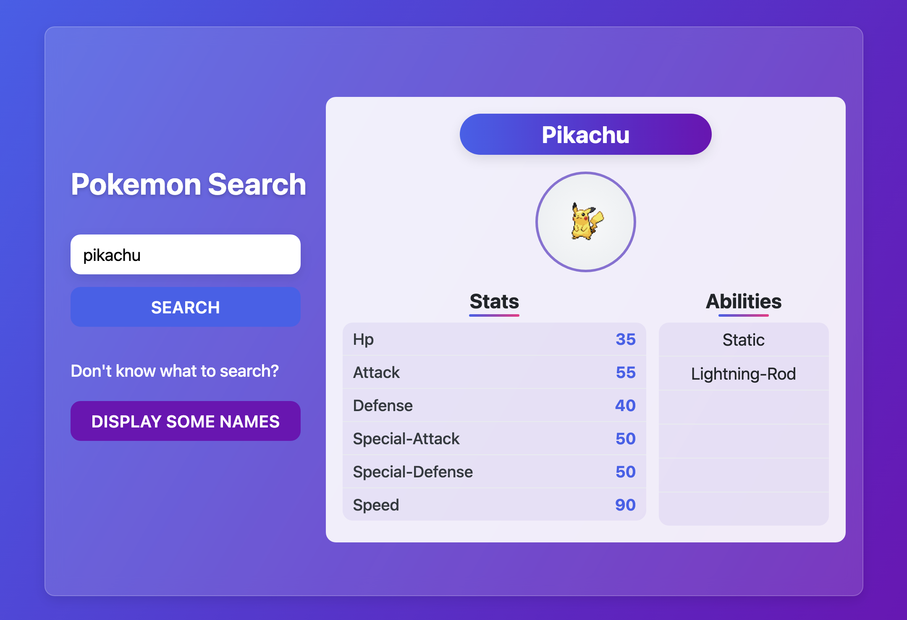

# Pokémon Search

A simple web application that allows users to search for Pokémon by name and view their stats and abilities.

## App Previews

<table>
  <tr>
    <td align="center"><br><b>Home Screen:</b> Initial app view with search form</td>
    <td align="center"><br><b>Search Results:</b> Detailed view of Pokémon with stats and abilities</td>
  </tr>
  <tr>
    <td align="center"><br><b>Pokemon List:</b> Available Pokémon names for selection</td>
    <td align="center"><br><b>Error Message:</b> When Pokémon cannot be found</td>
  </tr>
</table>

## Features

- Search for Pokémon by name (e.g., "Pikachu")
- Display Pokémon's image, stats, and abilities
- Option to view a list of available Pokémon names if you don't know what to search for

## Technologies Used

- HTML5
- CSS3
- JavaScript (ES6+)
- [PokéAPI](https://pokeapi.co/) - A RESTful Pokémon API

## How to Use

1. Search for a Pokémon:
   - Type a Pokémon name in the search box (e.g., "Pikachu", "Charizard")
   - Click the "Search" button
   - View the Pokémon's details including name, image, stats, and abilities

2. If you're not sure what to search for:
   - Click "Display some names" to see a list of available Pokémon names

## Project Structure

```
├── README.md
├── index.html
├── script.js
└── style.css
```

- `index.html`: Main HTML file for the application
- `style.css`: CSS styling for the application
- `script.js`: JavaScript code for handling API requests and UI interactions
- `.vscode/settings.json`: VS Code configuration for Live Server

## API Integration

This application uses the [PokéAPI](https://pokeapi.co/) to fetch Pokémon data. The API endpoints used are:

- `https://pokeapi.co/api/v2/pokemon/{name}` - Get details of a specific Pokémon by name
- `https://pokeapi.co/api/v2/pokemon/` - Get a list of Pokémon names